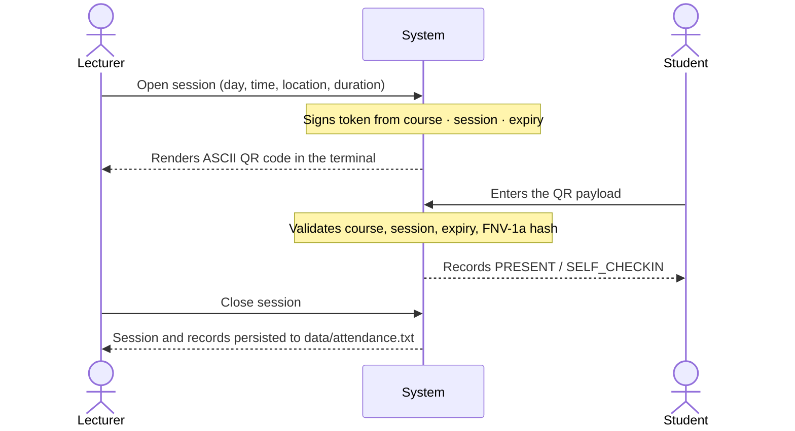
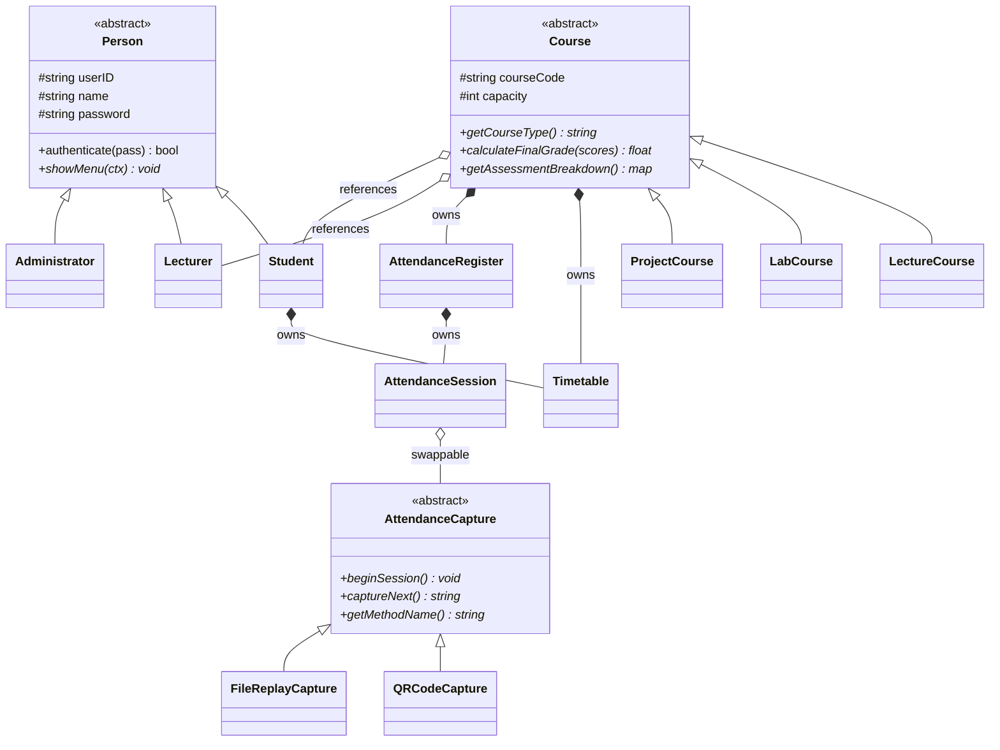

# CO2203 — Course Registration & Attendance System

A console-based **Learning Management System** written in modern C++17. Students enrol in courses, lecturers open QR-verified attendance sessions, and administrators manage users, offerings and reports — all persisted to plain-text files so the whole system runs with no database and no external dependencies.

<p align="left">
  
  
  
  
</p>

---

## Table of contents

- [Overview](#overview)
- [Features](#features)
- [QR attendance flow](#qr-attendance-flow)
- [Build and run](#build-and-run)
- [Sample logins](#sample-logins)
- [Project structure](#project-structure)
- [Design notes](#design-notes)
- [Data file formats](#data-file-formats)
- [Exception hierarchy](#exception-hierarchy)
- [Known limitations](#known-limitations)

---

## Overview

The system models a university registration workflow around three roles that share a common `Person` base class. Whoever logs in gets their own dashboard, driven entirely through runtime polymorphism — `main()` calls a single `showMenu()` on a `Person*` and never knows which role it is talking to.

Three course types (`Lecture`, `Lab`, `Project`) extend an abstract `Course` and each defines its own assessment weighting, so adding a fourth course type requires no changes to the enrolment or attendance code.

Everything lives in `data/*.txt`. State is loaded at startup and written back on logout, which makes the system easy to inspect, diff and hand in.

**At a glance**

| | |
|---|---|
| Language | C++17 (no third-party libraries beyond a vendored QR encoder) |
| Roles | Student, Lecturer, Administrator |
| Course types | Lecture, Lab, Project |
| Capture methods | QR code, file replay |
| Persistence | Pipe-delimited flat files in `data/` |
| Build | `make` or CMake ≥ 3.16 |
| Binary | `bin/registration` |

---

## Features

### Student

| # | Capability |
|---|---|
| 1 | View enrolled courses |
| 2 | View weekly timetable |
| 3 | Enrol in a course — validated against capacity, prerequisites and timetable clashes |
| 4 | Drop a course |
| 5 | Check in to an open attendance session by entering the QR payload |
| 6 | View personal attendance record and percentage per course |

### Lecturer

| # | Capability |
|---|---|
| 1 | View assigned courses |
| 2 | View course enrolment list with capacity usage |
| 3 | Open an attendance session and choose a capture method |
| 4 | Close an attendance session |
| 5 | Record an attendance correction (with reason and acting lecturer, kept as an audit trail) |
| 6 | View attendance statistics per student |

Lecturers can only open sessions for courses actually assigned to them — anything else is refused with `[Access Denied]`.

### Administrator

| # | Capability |
|---|---|
| 1–3 | Create, update and remove user accounts |
| 4–6 | Create, edit and remove course offerings |
| 7 | Generate a course enrolment summary report |
| 8 | Generate an exam-eligibility report against an attendance threshold (default **80%**) |
| 9 | Assign a lecturer to a course |
| 10 | Add a time slot to a course |
| 11–12 | Add and remove course prerequisites |

New accounts get an auto-generated ID from the role prefix — `S0001` for students, `L0001` for lecturers, `A0001` for admins — by scanning existing IDs and incrementing the highest.

### Assessment weightings

Each course subclass overrides `getAssessmentBreakdown()` and `calculateFinalGrade()`:

| Course type | Components |
|---|---|
| **Lecture** | Assignments 20% · Midterm 30% · Final exam 50% |
| **Lab** | Lab reports 40% · Practical exam 30% · Viva 30% |
| **Project** | Milestones 20% · Implementation 50% · Defence & report 30% |

---

## QR attendance flow

Attendance capture sits behind the abstract `AttendanceCapture` interface, so the mechanism is swappable at runtime without the session knowing which one it holds.



Tokens are bound to the course code, session ID and an expiry timestamp, then hashed with a shared secret (FNV-1a), so a payload cannot be replayed into a different session or used after the session window has passed. The QR itself is rendered as ASCII art in the terminal by the vendored [`qrcodegen`](https://www.nayuki.io/page/qr-code-generator-library) encoder.

**Capture methods**

- **`QRCodeCapture`** — prints a scannable QR code and accepts validated payloads.
- **`FileReplayCapture`** — replays check-in events from a text file, one per line, for testing and demos:

  ```
  CHECKIN|S0001
  CHECKIN|S0002
  ```

  Malformed lines raise `DataCorruptedException` naming the exact file and line number.

Sessions opened with a duration expire automatically, and `markAttendance()` throws on a closed session, an unenrolled student, or a duplicate check-in.

---

## Build and run

**Requirements:** a C++17 compiler (g++ 7+ / clang 5+) and either GNU Make or CMake ≥ 3.16.

### Using Make

```bash
make          # build → bin/registration
make run      # build and run
make clean    # remove build/ and bin/
```

### Using CMake

```bash
cmake -S . -B build
cmake --build build -j
./build/bin/registration
```

Both paths compile the same sources with `-std=c++17 -Wall`. The `data/` directory is created automatically on first run if it is missing.

---

## Sample logins

The repository ships with sample data in `data/`, so the system is usable immediately:

| Role | ID | Password |
|---|---|---|
| Administrator | `admin` | `admin` |
| Lecturer | `L0001` | `saman` |
| Student | `S0001` | `sathaka` |

If `data/users.txt` is missing entirely, the system bootstraps a single `admin` / `admin` account on first run so you are never locked out.

> Passwords are stored in plain text. This is a coursework project, not a production system — see [Known limitations](#known-limitations).

---

## Project structure

```
CO2203_LMS/
├── include/
│   ├── app/
│   │   └── SystemContext.h          # Reference bundle passed into every menu
│   ├── domain/                      # Person, Student, Lecturer, Administrator
│   │   └── ...                      # Course + Lecture/Lab/Project subclasses
│   ├── scheduling/
│   │   ├── TimeSlot.h               # Day/start/end/location, overlap operators
│   │   ├── Timetable.h              # Manual dynamic array, Rule of Five
│   │   └── EnrollmentEngine.h       # Prerequisite and clash validation
│   ├── attendance/
│   │   ├── AttendanceCapture.h      # Abstract capture strategy
│   │   ├── QRCodeCapture.h          # QR generation + validation
│   │   ├── FileReplayCapture.h      # Replay check-ins from a file
│   │   ├── QrToken.h                # Token signing, validation, ASCII QR
│   │   ├── AttendanceSession.h      # One sitting: records + corrections
│   │   ├── AttendanceRegister.h     # All sessions for a course; percentages
│   │   ├── AttendanceRecord.h
│   │   └── CorrectionRecord.h
│   ├── persistence/
│   │   ├── Repository.h             # Templated base: Repository<T>
│   │   ├── UserRepository.h         # Login, role prefixes, ID generation
│   │   ├── CourseRepository.h       # Courses + attendance persistence
│   │   └── StorageUtils.h           # split/join, field validation, parsing
│   ├── exception/
│   │   └── Exceptions.h             # Three-level exception hierarchy
│   └── third_party/
│       └── qrcodegen.hpp            # Vendored QR encoder
├── src/                             # Mirrors include/, one .cpp per class
│   └── main.cpp                     # Load → login → dispatch menu → save
├── data/
│   ├── users.txt
│   ├── courses.txt
│   └── attendance.txt
├── Makefile
└── CMakeLists.txt
```

Headers carry `// Owner:` and `// Used by:` comments recording which team member owns each module and which other modules depend on it.

---

## Design notes

Two abstract bases carry the whole design. `Person` makes every role interchangeable behind a single `showMenu()` call, and `Course` lets each course type define its own assessment rules without touching enrolment or attendance:



The project is deliberately built around core object-oriented techniques:

| Concept | Where it appears |
|---|---|
| **Abstraction** | `Person`, `Course` and `AttendanceCapture` are abstract with pure virtual methods |
| **Inheritance** | `Student`/`Lecturer`/`Administrator` from `Person`; three course types from `Course` |
| **Runtime polymorphism** | `main()` holds a `Person*` and calls `showMenu()`; sessions hold an `AttendanceCapture*` |
| **Templates** | `Repository<T>` is specialised by `UserRepository` and `CourseRepository` |
| **Operator overloading** | `operator<<` on `Person`, `Course`, `TimeSlot`, `Timetable`; `operator==` and `operator&` for slot overlap |
| **Rule of Five** | `Timetable` manages a raw `TimeSlot**` buffer with copy/move constructors and assignment |
| **Static members** | `Person::totalUsers`, `AttendanceRegister::DEFAULT_THRESHOLD` |
| **Exception handling** | Custom hierarchy rooted at `BaseException`, caught per menu action so the session survives errors |
| **Composition vs aggregation** | A `Course` **owns** its timetable and register; it **references** its lecturer and students |
| **RAII / ownership** | `Repository<T>` deletes everything it holds; non-owning pointers are documented as aggregation |

Ownership is documented in the headers themselves so the memory model stays explicit: composition members are deleted by their owner, while aggregation pointers are left alone.

`SystemContext` bundles the repositories, the enrolment engine and the file paths into one reference struct that is created once in `main()` and passed into each `showMenu()`, avoiding globals without threading half a dozen parameters through every call.

---

## Data file formats

All files are pipe-delimited (`|`), one record per line, with `#` comment headers. Within a field, lists are separated by `,` and time slots by `;`. Fields are validated on save — any value containing a delimiter or line break is rejected rather than silently corrupting the file.

### `data/users.txt`

```
# ROLE|userID|name|password|completedCourses
LECTURER|L0001|saman|saman|
STUDENT|S0001|sathaka|sathaka|CO1101,CO1102
ADMIN|admin|Admin|admin|
```

### `data/courses.txt`

```
# TYPE|code|title|credits|capacity|lecturerID|prerequisites|timeslots|students
Lecture|CO2202|OOP|2|35|L0001||Tuesday,08:30,10:30,LT1|S0001
```

Each time slot is `day,start,end,location`; multiple slots are joined with `;`.

### `data/attendance.txt`

```
# SESSION|code|sessionID|day|start|end|location|state|openedAt|durationMins
# RECORD|code|sessionID|studentID|timestamp|status|method
# CORRECTION|code|sessionID|studentID|lecturerID|reason|status|timestamp
SESSION|CO2202|2|Tuesday|10:30|10:45|LT1|CLOSED|1789751089|15
RECORD|CO2202|2|S0001|2026-09-18 22:35:35|PRESENT|SELF_CHECKIN
```

An open session stores its `openedAt` timestamp and duration, so an in-progress session is correctly restored — and correctly expired — across restarts.

---

## Exception hierarchy

All custom exceptions derive from `BaseException : std::exception`, grouped so that callers can catch broadly or precisely.

```
BaseException
├── EnrollmentException
│   ├── CourseFullException            capacity reached
│   ├── PrerequisiteNotMetException    required course not completed
│   └── TimetableClashException        slot overlaps an existing one
├── AttendanceException
│   ├── SessionClosedException         session closed or not yet open
│   ├── NotEnrolledException           student not on the course
│   └── DuplicateAttendanceException   already marked present
└── StorageException
    ├── DataCorruptedException         bad field count, bad number, dangling reference
    └── MissingFileException           file could not be opened
```

`main()` treats a failed load as fatal and exits before any save, so a corrupted file is never overwritten with partial data.

---

## Known limitations

These are known and intentional trade-offs for a coursework build:

- **Passwords are stored in plain text** — no hashing or salting.
- **The QR secret is compiled in** as a constant rather than supplied by configuration.
- **Single-user, single-session** — one login per run, with state written on logout; concurrent access would race on the data files.
- **No automated test suite**; `FileReplayCapture` covers the manual testing path for attendance.
- **Day names are not validated** against a fixed set, so a typo in a session day is stored as given.
- A few `-Wsign-compare` warnings remain from signed loop counters compared against `.size()`.

---

## License

Academic coursework for module **CO2203**. No license is specified; please contact the repository owner before reuse.
