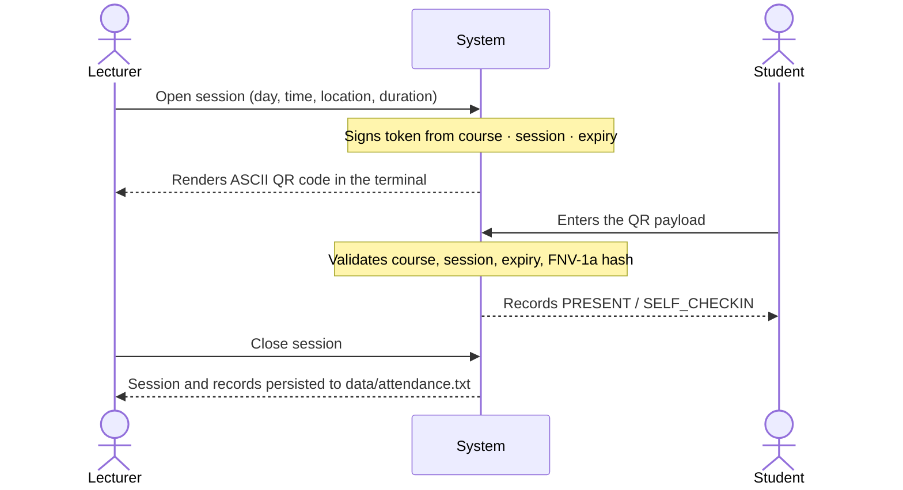

# CO2203 — Course Registration & Attendance System

A console-based **Learning Management System** written in modern C++17. Students enrol in courses, lecturers open QR-verified attendance sessions, and administrators manage users, offerings and reports — all persisted to plain-text files so the whole system runs with no database and no external dependencies.

---

## Overview

The system models a university registration workflow around three roles that share a common `Person` base class. Whoever logs in gets their own dashboard, driven entirely through runtime polymorphism — `main()` calls a single `showMenu()` on a `Person*` and never knows which role it is talking to.

Three course types (`Lecture`, `Lab`, `Project`) extend an abstract `Course` and each defines its own assessment weighting, so adding a fourth course type requires no changes to the enrolment or attendance code.

Everything lives in `data/*.txt`. State is loaded at startup and written back on logout, which makes the system easy to inspect, diff and hand in.

**At a glance**

| | |
|---|---|
| Language | C++17 (no third-party libraries beyond a vendored QR encoder) |
| Roles | Student, Lecturer, Administrator |
| Course types | Lecture, Lab, Project |
| Capture methods | QR code, file replay |
| Persistence | Pipe-delimited flat files in `data/` |
| Build | `make` or CMake ≥ 3.16 |
| Binary | `bin/registration` |

---

## Features

### Student

| # | Capability |
|---|---|
| 1 | View enrolled courses |
| 2 | View weekly timetable |
| 3 | Enrol in a course — validated against capacity, prerequisites and timetable clashes |
| 4 | Drop a course |
| 5 | Check in to an open attendance session by entering the QR payload |
| 6 | View personal attendance record and percentage per course |

### Lecturer

| # | Capability |
|---|---|
| 1 | View assigned courses |
| 2 | View course enrolment list with capacity usage |
| 3 | Open an attendance session and choose a capture method |
| 4 | Close an attendance session |
| 5 | Record an attendance correction (with reason and acting lecturer, kept as an audit trail) |
| 6 | View attendance statistics per student |

Lecturers can only open sessions for courses actually assigned to them — anything else is refused with `[Access Denied]`.

### Administrator

| # | Capability |
|---|---|
| 1–3 | Create, update and remove user accounts |
| 4–6 | Create, edit and remove course offerings |
| 7 | Generate a course enrolment summary report |
| 8 | Generate an exam-eligibility report against an attendance threshold (default **80%**) |
| 9 | Assign a lecturer to a course |
| 10 | Add a time slot to a course |
| 11–12 | Add and remove course prerequisites |

New accounts get an auto-generated ID from the role prefix — `S0001` for students, `L0001` for lecturers, `A0001` for admins — by scanning existing IDs and incrementing the highest.

### Assessment weightings

Each course subclass overrides `getAssessmentBreakdown()` and `calculateFinalGrade()`:

| Course type | Components |
|---|---|
| **Lecture** | Assignments 20% · Midterm 30% · Final exam 50% |
| **Lab** | Lab reports 40% · Practical exam 30% · Viva 30% |
| **Project** | Milestones 20% · Implementation 50% · Defence & report 30% |

---

## QR attendance flow

Attendance capture sits behind the abstract `AttendanceCapture` interface, so the mechanism is swappable at runtime without the session knowing which one it holds.



Tokens are bound to the course code, session ID and an expiry timestamp, then hashed with a shared secret (FNV-1a), so a payload cannot be replayed into a different session or used after the session window has passed. The QR itself is rendered as ASCII art in the terminal by the vendored [`qrcodegen`](https://www.nayuki.io/page/qr-code-generator-library) encoder.

**Capture methods**

- **`QRCodeCapture`** — prints a scannable QR code and accepts validated payloads.
- **`FileReplayCapture`** — replays check-in events from a text file, one per line, for testing and demos:

  ```
  CHECKIN|S0001
  CHECKIN|S0002
  ```

  Malformed lines raise `DataCorruptedException` naming the exact file and line number.

Sessions opened with a duration expire automatically, and `markAttendance()` throws on a closed session, an unenrolled student, or a duplicate check-in.

---

## Build and run

**Requirements:** a C++17 compiler (g++ 7+ / clang 5+) and either GNU Make or CMake ≥ 3.16.

### Using Make

```bash
make          # build → bin/registration
make run      # build and run
make clean    # remove build/ and bin/
```

### Using CMake

```bash
cmake -S . -B build
cmake --build build -j
./build/bin/registration
```

Both paths compile the same sources with `-std=c++17 -Wall`. The `data/` directory is created automatically on first run if it is missing.
